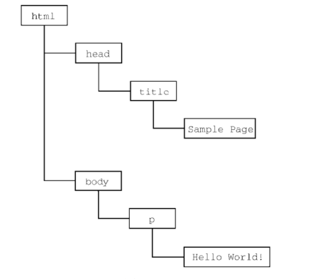

# 概述

JavaScript（简称 JS）是一种高效、灵活、广泛应用的编程语言，主要用于 Web 开发。它最初由 Netscape 的 Brendan Eich 在 1995 年开发，最早命名为 LiveScript，后改名为 JavaScript。尽管名称中有“Java”，但 JavaScript 和 Java 是两种完全不同的编程语言。

出现背景：js出现之前，要验证某个必填字段是否已填写，或者某个输入的值是否有效，需要与服务器的一次往返通信，在通过电话上网的年代，缓慢的网速让页面每次刷新都考验着人们的耐心。

**核心特性**

* **动态类型**：变量的类型在运行时确定，可以在不同的上下文中自动转换类型。
* **弱类型**：允许不同类型之间进行隐式转换，例如字符串和数字之间的转换。
* **原型继承**：JavaScript 采用原型继承（prototype-based inheritance）模型，而不是传统的类继承。每个对象都可以作为其他对象的原型，从而实现继承。
* **多范式**：支持面向对象和面向过程
* **解释执行**：代码在运行时由 JavaScript 引擎（如 V8、SpiderMonkey）直接执行，而不是事先编译成二进制文件

**重要阶段**

**1995**: JavaScript 由 Netscape 推出，用于在浏览器中增强用户体验。

**1997**: JavaScript 被 ECMA（欧洲计算机制造商协会）标准化，形成了 ECMAScript 标准。

**2009**: Node.js 发布，使得 JavaScript 可以用于服务器端编程，从而实现了前后端通用的开发语言。

**2015**: ECMAScript 6（ES6）发布，这是 JavaScript 语言的一次重大更新，引入了诸如 `let`、`const`、箭头函数、类、模块等众多新特性。

## 组成

完整的js实现包含以下三部分：

* ECMA Script：核心，简称es
* DOM：文档对象模型
* BOM：浏览器对象模型

### ES

ECMAScript，即 ECMA-262 定义的语言，并不局限于 Web 浏览器，。ECMA-262 将这门语言作为一个基准来定义，以便在它之上再构建更稳健的脚本语言。浏览器只是es实现可能存在的一种宿主环境。宿主环境提供ECMAScript 的基准实现和与环境自身交互必需的扩展。扩展（比如 DOM）使用 ECMAScript 核心类型和语法，提供特定于环境的额外功能。其他宿主环境还有服务器端 JavaScript 平台 Node.js 和即将被淘汰的 Adobe Flash。

ES描述了语言的基本部分：

* 语法
* 类型
* 语句
* 关键字
* 保留字
* 操作符
* 全局对象

ECMAScript 只是对实现这个规范描述的所有方面的一门语言的称呼。JavaScript 实现了ECMAScript，而 Adobe ActionScript 同样也实现了 ECMAScript。

#### 版本

* ES第一版：本质上与网景的js1.1相同，只是删除了所有浏览器特定的代码，外加少量细微的修改，ECMA-262 要求支持 Unicode 标准（以支持多语言），而且对象要与平台无关（Netscape JavaScript 1.1 的对象不是这样，比如它的 Date 对象就依赖平台）。这也是 JavaScript 1.1 和 JavaScript 1.2 不符合 ECMA-262 第 1 版要求的原因。
* ES2：ECMA-262 第 2 版只是做了一些编校工作，主要是为了更新之后严格符合 ISO/IEC-16262 的要求，并没有增减或改变任何特性。ECMAScript 实现通常不使用第 2 版来衡量符合性（conformance）。
* ES3：第一次真正进行版本更新，更新了字符串处理、错误定义和数值输出。此外还增加了对正则表达式、新的控制语句、try/catch 异常处理的支持，以及为了更好地让标准国际化所做的少量修改。对很多人来说，这标志着 ECMAScript 作为一门真正的编程语言的时代终于到来了。
* ES4：为了满足全球web开发日益增长的需求，对语言进行了彻底的修订，包括强类型变量、新语句和数据结构、真正的类和经典的继承，以及操作数据的新手段，**由于改动太大，在正式发布前被废弃**
* ES5：在es4标准修订期间，TC39 委员会的一个子委员会也提出了另外一份提案，叫作“ECMAScript 3.1”，只对这门语言进行了较少的改进，最终ECMAScript 3.1 变成了 ECMA-262 的第 5 版，于 2009 年 12 月 3 日正式发布。第 5 版致力于厘清第 3 版存在的歧义，也增加了新功能。新功能包括原生的解析和序列化 JSON 数据的 JSON 对象、方便继承和高级属性定义的方法，以及新的增强 ECMAScript 引擎解释和执行代码能力的严格模式。第 5 版在 2011 年 6 月发布了一个维护性修订版，这个修订版只更正了规范中的错误，并未增加任何新的语言或库特性。
* ES6：2015年6月发布，ES6 正式支持了类、模块、迭代器、生成器、箭头函数、期约、反射、代理和众多新的数据类型。
* ES7：2016年6月发布，这次修订只包含少量语法层面的增强，如 Array.prototype.includes 和指数操作符
* ES8：2017年6月发布，这一版主要增加了异步函数（async/ await）、SharedArrayBuffer 及 Atomics API，以及Object.values()/Object.entries()/Object. getOwnPropertyDescriptors()和字符串填充方法，另外明确支持对象字面量最后的逗号。
* ES9：2018年6月发布，这次修订包括异步迭代、剩余和扩展属性、一组新的正则表达式特性、Promise finally()，以及模板字面量修订。
* ES10：2019年6月发布，这次修订增加了 Array.prototype. flat()/flatMap()、String.prototype.trimStart()/trimEnd()、Object.fromEntries()方法，以及 Symbol.prototype.description 属性，明确定义了 Function.prototype.toString()的返回值并固定了 Array.prototype.sort()的顺序。另外，这次修订解决了与 JSON 字符串兼容的问题，并定义了 catch 子句的可选绑定。

#### 符合性

ECMA-262 阐述了什么是 ECMAScript 符合性。要成为 ECMAScript 实现，必须满足下列条件：

* 支持 ECMA-262 中描述的所有“类型、值、对象、属性、函数，以及程序语法与语义”；
* 支持 Unicode 字符标准。

非必须条件：

* 增加 ECMA-262 中未提及的“额外的类型、值、对象、属性和函数”。ECMA-262 所说的这些额外内容主要指规范中未给出的新对象或对象的新属性。
* 支持 ECMA-262 中没有定义的“程序和正则表达式语法”（意思是允许修改和扩展内置的正则表达式特性）。

以上条件为实现开发者基于 ECMAScript 开发语言提供了极大的权限和灵活度，也是其广受欢迎的原因之一。

#### 浏览器支持

到了 2008 年，五大浏览器（IE、Firefox、Safari、Chrome 和 Opera）全部兼容 ECMA-262 第 3 版。

具体可参照浏览器版本对es的支持表。

### DOM

文档对象模型（DOM，Document Object Model）是一个应用编程接口（API），用于在 HTML 中使用扩展的 XML。DOM 将整个页面抽象为一组分层节点。HTML 或 XML 页面的每个组成部分都是一种节点，包含不同的数据。

如下：

```html
<html>
    <head>
        <title>Sample Page</title>
    </head>
    <body>
        <p>
            Hello World!
        </p>
    </body>
</html>
```



DOM 通过创建表示文档的树，让开发者可以随心所欲地控制网页的内容和结构。使用 DOM API，可以轻松地删除、添加、替换、修改节点。

#### DOM级别

* DOM1：1998 年 10 月，DOM Level 1 成为 W3C 的推荐标准
    * DOM core：映射 XML 文档，从而方便访问和操作文档任意部分的方式
    * DOM Html：扩展core，增加了特定于html的对象和方法
* DOM2：增加了对（DHTML 早就支持的）鼠标和用户界面事件、范围、遍历（迭代 DOM 节点的方法）的支持，而且通过对象接口支持了层叠样式表（CSS）。另外，DOM Level 1 中的 DOM Core 也被扩展以包含对 XML 命名空间的支持。
    * 视图：描述追踪文档不同视图（如应用 CSS 样式前后的文档）的接口
    * 事件：描述事件及事件处理的接口
    * 样式：描述处理元素 CSS 样式的接口
    * 遍历和范围：描述遍历和操作 DOM 树的接口。
* DOM3：进一步扩展了 DOM，增加了以统一的方式加载和保存文档的方法（包含在一个叫 DOM Load and Save 的新模块中），还有验证文档的方法（DOM Validation）。在 Level 3 中，DOM Core 经过扩展支持了所有 XML 1.0 的特性，包括 XML Infoset、XPath 和 XML Base。
* 其他DOM，比如基于XML的DOM方法和接口：
    * SVG ：可伸缩矢量图
    * MathML：数学标记语言
    * SMIL：同步多媒体集成语言

### BOM

IE3 和 Netscape Navigator 3 提供了浏览器对象模型（BOM） API，用于支持访问和操作浏览器的窗口，BOM原来是唯一一个没有相关标准的js实现，HTML5 改变了这个局面，这个版本的 HTML 以正式规范的形式涵盖了尽可能多的 BOM 特性。由于 HTML5 的出现，之前很多与 BOM有关的问题都迎刃而解了。

BOM主要针对浏览器窗口和子窗口，不过人们通常会把任何特定于浏览器的扩展都归在 BOM 的范畴内。比如：

* 弹出新浏览器窗口的能力；
* 移动、缩放和关闭浏览器窗口的能力；
* navigator 对象，提供关于浏览器的详尽信息；
* location 对象，提供浏览器加载页面的详尽信息；
* screen 对象，提供关于用户屏幕分辨率的详尽信息；
* performance 对象，提供浏览器内存占用、导航行为和时间统计的详尽信息；
* 对 cookie 的支持；
*  其他自定义对象，如 XMLHttpRequest 和 IE 的 ActiveXObject

## 总结

JavaScript 是一门用来与网页交互的脚本语言，包含以下三个组成部分。

* ECMAScript：由 ECMA-262 定义并提供核心功能。
* 文档对象模型（DOM）：提供与网页内容交互的方法和接口。
* 浏览器对象模型（BOM）：提供与浏览器交互的方法和接口。

JavaScript 的这三个部分得到了五大 Web 浏览器（IE、Firefox、Chrome、Safari 和 Opera）不同程度的支持。所有浏览器基本上对 ES5（ECMAScript 5）提供了完善的支持，而对 ES6（ECMAScript 6）和ES7（ECMAScript 7）的支持度也在不断提升。这些浏览器对 DOM的支持各不相同，但对 Level 3 的支持日益趋于规范。HTML5 中收录的 BOM 会因浏览器而异，不过开发者仍然可以假定存在很大一部分公共特性。

# html中的js

JavaScript 插入 HTML 的主要方法是使用`<script>`元素。属性如下所示：

* src：指定外部 JavaScript 文件的 URL，使用该属性时，忽略标签内的代，外部的js文件扩展名不一定非要是.js
* type：指定脚本的 MIME 类型。默认情况下是 `text/javascript`，这是标准的 JavaScript 类型。在大多数情况下，不需要显式设置此属性，除非你使用非 JavaScript 语言（如 TypeScript 或其他脚本语言）。
* async:此属性适用于外部脚本（即使用 `src` 属性的脚本）。它指示浏览器异步加载脚本文件，这意味着脚本不会阻塞页面的解析。当脚本加载完成后立即执行。多个带有 `async` 属性的脚本可能会以任何顺序执行。
* defer:此属性适用于外部脚本。它指示浏览器延迟脚本的执行，直到整个页面完成解析。这保证了脚本的执行顺序与它们在文档中的顺序一致，并且在 `DOMContentLoaded` 事件之前执行，注意：该属性表示脚本在执行的时候不会改变页面的结构
* crossorigin:设置跨域请求的模式，用于加载外部资源时指定请求是否应该带有凭据（如 cookies）。它可以取值为：
  * `anonymous`：不带凭据请求资源。
  * `use-credentials`：带凭据请求资源。
* integrity:提供一个基于哈希值的内容安全策略，验证外部脚本的完整性，确保加载的内容未被篡改。这个属性通常与 `crossorigin` 一起使用。
* nomodule:此属性用于确保脚本在支持 ES 模块的浏览器中不被执行，通常用于向下兼容的脚本。仅当浏览器不支持 `<script type="module">` 时才会执行该脚本。

**注意**：

1、包含在script脚本内的代码会被从上到下解释执行。

2、在解析src资源时，会向指定的路径发送get请求，这个请求不受浏览器同源策略限制，但返回被执行的js则受限制

3、async和defer不能保证脚本按照出现的顺序执行

**使用方式**

* 行内代码
* 外部文件 推荐
  * 可维护性好，浏览器可缓存外部文件，多个页面可以共用同一个文件

* 动态加载
  * 以动态加载方式获取的资源对浏览器预加载器是不可见的，这会严重影响他们在资源获取队列中的优先级。在文档头部显示声明`<link rel="preload" href="des.js">`可以解决
  * 维护复杂，调试困难


```html
<!DOCTYPE html>
<html lang="en">
<head>
    <meta charset="UTF-8">
    <title>Title</title>
</head>
<body>
<script>
    console.log('行内脚本')
</script>

<!--外部文件-->

<script src="src/test01.js"></script>


<!--动态加载-->
<script>
    let script = document.createElement('script')
    script.src = 'src/test01.js'
    document.head.append(script)
</script>
</body>
</html>
```

以动态加载方式获取的资源对浏览器预加载器是不可见的，这会严重影响他们在资源获取队列中的优先级。要想让预加载器知道动态请求文件的存在。
